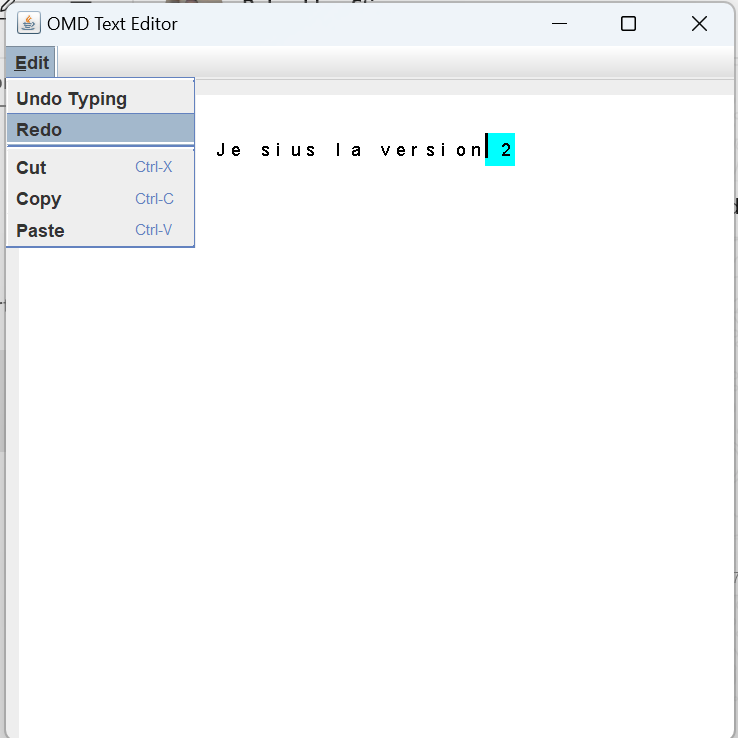

## v2 🥇
# Mini-Éditeur de Texte v2
### Description du Projet
Le mini-éditeur de texte est une application simple qui permet aux utilisateurs d'éditer du texte de manière basique.
Il offre des fonctionnalités telles que la sélection, la coupe, la copie, le collage,
ainsi que les fonctionnalités Annuler (Ctrl+Z) et Rétablir (Ctrl+Y).

### 👌Fonctionnalités
- Sélection de Texte : Cliquez avec la souris et faites glisser pour sélectionner le texte.
- Couper (Ctrl+X) : Coupez le texte sélectionné.
- Copier (Ctrl+C) : Copiez le texte sélectionné.
- Coller (Ctrl+V) : Collez le texte du presse-papiers à l'emplacement du curseur.
- Annuler (Ctrl+Z) : Annulez la dernière action.
- Rétablir (Ctrl+Y) : Rétablissez une action précédemment annulée.

### 💡 Aperçu


# 🎗️ Comment Utiliser l'Application
- Pour Sélection de Texte :

```
1. Cliquez à l'endroit où vous voulez commencer la sélection.
2. Maintenez le bouton de la souris enfoncé et faites glisser pour sélectionner le texte.
```
- Couper (Ctrl+X) :
``` 
1. Sélectionnez le texte que vous voulez couper.
2. Appuyez sur Ctrl+X (ou sur le bouton Cut dans Edit) pour couper le texte sélectionné.
```

- Copier (Ctrl+C) :
```
1. Sélectionnez le texte que vous voulez copier.
2. Appuyez sur Ctrl+C (ou sur le bouton Copy dans Edit) pour copier le texte sélectionné.
```


- Coller (Ctrl+V) :
```
1. Placez le curseur à l'endroit où vous voulez coller le texte.
2. Appuyez sur Ctrl+V (ou sur le bouton Paste dans Edit) pour coller le texte du presse-papiers.
```

- Annuler (Ctrl+Z) :
```
Appuyez sur Ctrl+Z (ou sur le bouton Undo dans Edit) pour annuler la dernière action.
```

- Rétablir (Ctrl+Y) :
```
Appuyez sur Ctrl+Y (ou sur le bouton Redo dans Edit) pour rétablir une action précédemment annulée.
```
